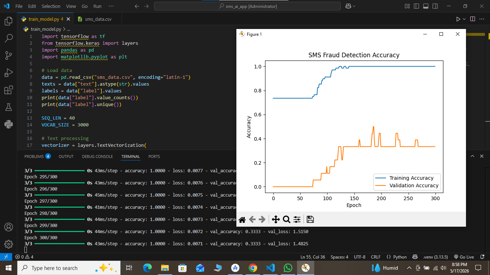
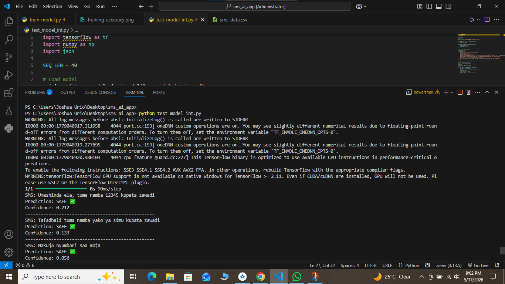
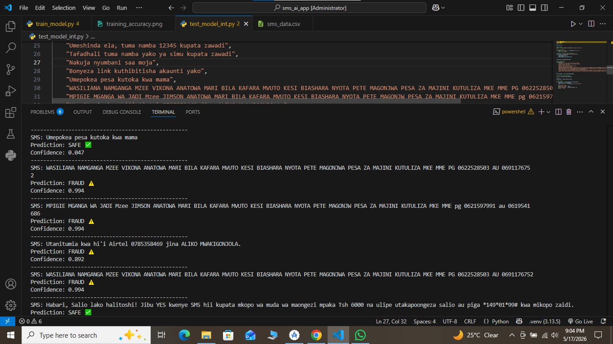

# 📱 SMS Fraud Detector — Swahili AI

An AI-powered SMS fraud detection system trained on Swahili text messages. It classifies SMS as **FRAUD ⚠️** or **SAFE ✅** using a TensorFlow text classification model. Includes a Flutter-ready TFLite export for mobile deployment.

---

## 🧠 What It Does

- Trains a neural network on labeled Swahili SMS data
- Detects fraud patterns like fake prizes, witchdoctor scams, phishing links, and M-Pesa fraud
- Exports a `.tflite` model and `vocab.json` for use in a Flutter mobile app
- Supports both string-input and integer-input model variants

---

## 📁 Project Structure

```
SMS_AI_APP/
├── sms_data.csv           # Training data (SMS text + label)
├── vocab.json             # Vocabulary list (auto-generated)
├── train_model.py         # Train model with built-in TextVectorization
├── train_model_int.py     # Train integer-input model (Flutter-compatible)
├── test_sms.py            # Test the string-input model
├── test_model_int.py      # Test the integer-input model
├── export_for_flutter.py  # Export TFLite model + vocab for Flutter
├── screenshots/           # Screenshots of results
├── sms_model.keras        # Trained model (string input) — not in repo
├── sms_model_int.keras    # Trained model (int input) — not in repo
└── sms_model_flutter.tflite  # TFLite model — not in repo
```

> **Note:** `.keras` and `.tflite` files are excluded from the repo (see `.gitignore`) because they are large binary files. Generate them by running the training scripts below.

---

## ⚙️ Requirements

- Python 3.8+
- TensorFlow 2.x
- pandas
- numpy
- matplotlib

---

## 🚀 Getting Started

### 1. Clone the repository

```bash
git clone https://github.com/YOUR_USERNAME/SMS_AI_APP.git
cd SMS_AI_APP
```

### 2. Install dependencies

```bash
pip install tensorflow pandas numpy matplotlib
```

### 3. Prepare your data

Make sure `sms_data.csv` is in the project folder with two columns:

| text | label |
|------|-------|
| Umeshinda zawadi... | 1 |
| Nakuja nyumbani saa moja | 0 |

- `1` = Fraud
- `0` = Safe/Legitimate

---

## 🏋️ Step 1 — Train the Model

Run this command to train the model. It will train for 300 epochs and automatically save the model and vocabulary:

```bash
python train_model_int.py
```

**What you will see in the terminal:**

```
Epoch 1/300
3/3 ━━━━━━━━━━━━━━━━━━━━ 1s - accuracy: 0.72 - loss: 0.69 - val_accuracy: 0.00
...
Epoch 300/300
3/3 ━━━━━━━━━━━━━━━━━━━━ 0s - accuracy: 1.00 - loss: 0.011
Saved sms_model_int.keras and vocab.json
```

To also generate the training accuracy graph, run:

```bash
python train_model.py
```

A graph window will pop up showing training vs validation accuracy:



---

## 🧪 Step 2 — Test the Model

After training, run this to test the model on sample Swahili SMS messages:

```bash
python test_model_int.py
```

**What you will see:**





The model correctly identifies:
- Witchdoctor scam messages → **FRAUD ⚠️** (confidence 0.994)
- Suspicious Airtel money requests → **FRAUD ⚠️** (confidence 0.892)
- Normal messages like "Nakuja nyumbani saa moja" → **SAFE ✅**

---

## 📦 Step 3 — Export for Flutter (Optional)

To generate a mobile-ready TFLite model:

```bash
python export_for_flutter.py
```

**Outputs:**
- `sms_model_flutter.tflite` — optimized model for Flutter mobile app
- `vocab.json` — vocabulary for tokenizing SMS in Dart

---

## 📊 Model Architecture

```
Input (integer token IDs, sequence length 40)
  → Embedding (vocab_size=3000, dim=16)
  → GlobalAveragePooling1D
  → Dense(16, relu)
  → Dense(1, sigmoid)
```

| Setting | Value |
|---------|-------|
| Loss | Binary Crossentropy |
| Optimizer | Adam |
| Epochs | 300 |
| Validation split | 20% |
| Vocabulary size | 3,000 tokens |
| Sequence length | 40 tokens |

---

## 🌍 Language & Fraud Types Detected

This model is trained on **Swahili (Kiswahili)** SMS messages, targeting fraud patterns common in Tanzania, including:

- Fake prize / lottery scams (`Umeshinda zawadi...`)
- Witchdoctor (mganga) solicitations (`WASILIANA NAMGANGA MZEE VIKONA...`)
- M-Pesa / mobile money phishing
- Suspicious loan offers
- Fake recruitment messages

---

## ⚠️ Known Limitation

The current dataset has only **86 messages** (50 safe, 36 fraud). The training accuracy reaches 100% but validation accuracy is lower, which means the model needs more data to generalize better. Adding more labeled SMS examples to `sms_data.csv` will significantly improve accuracy.

---

## 📄 License

MIT License — free to use, modify, and distribute.

---

## 👤 Author

**Joshua Urio**  
Built with TensorFlow · Designed for Tanzania 🇹🇿
